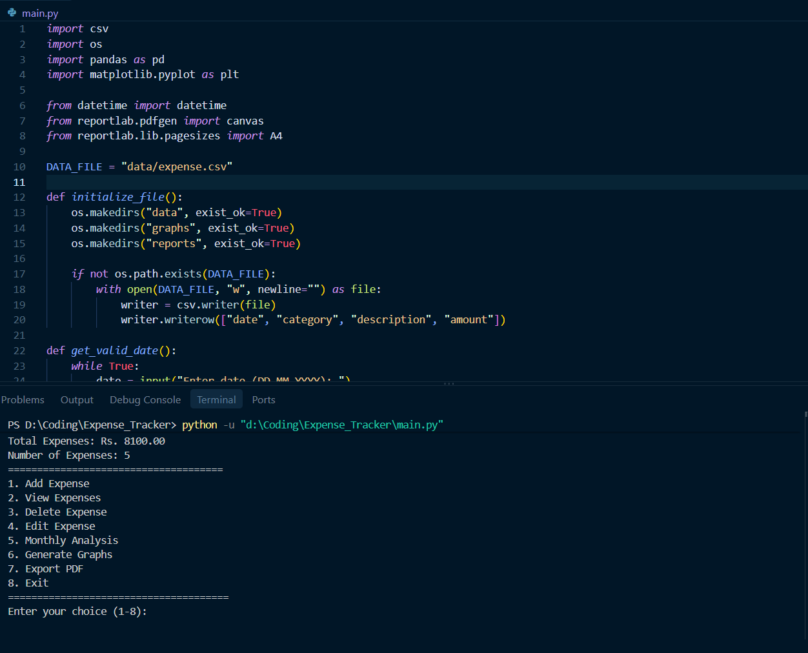
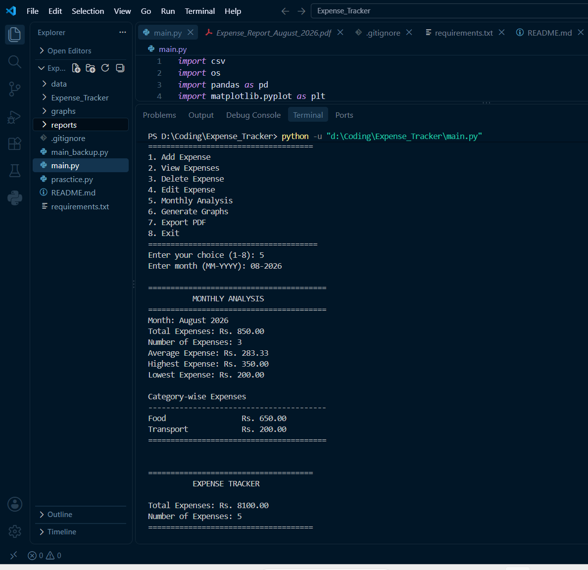
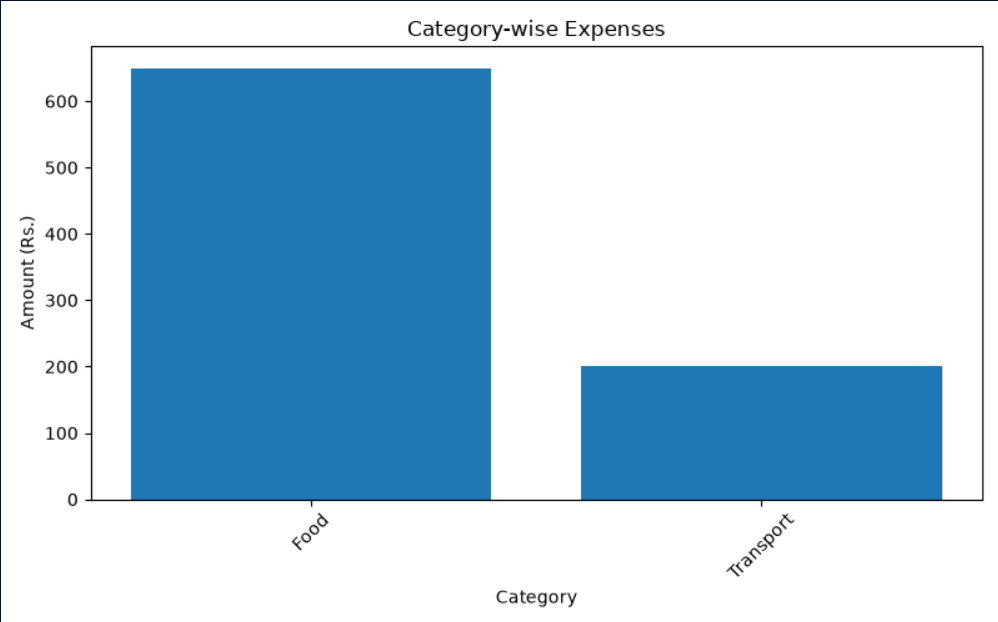
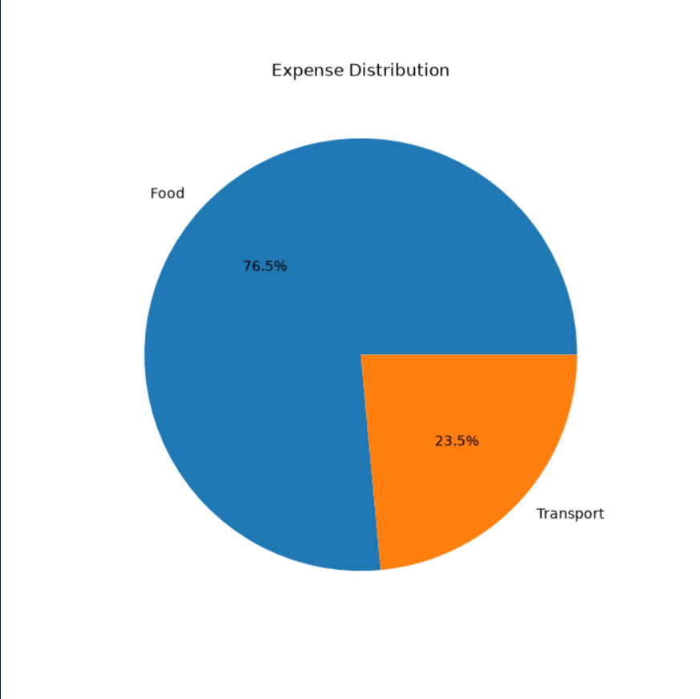
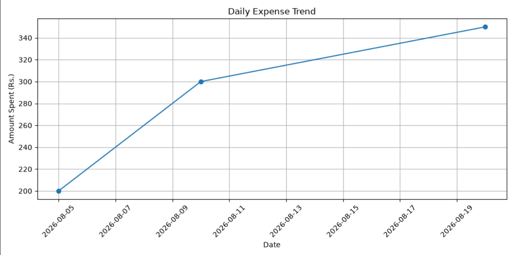
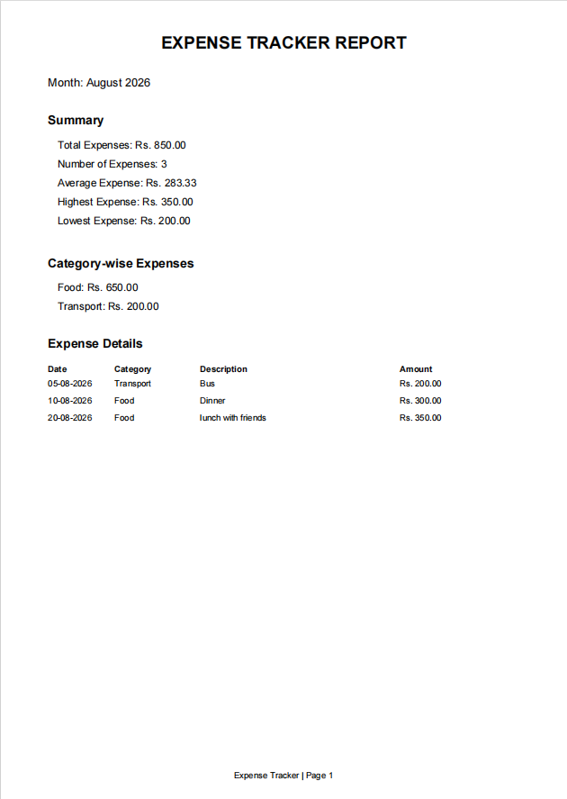

# 💰 Expense Tracker

A Python-based personal expense management application for recording, analyzing, visualizing, and reporting expenses.

## 📌 Overview

Expense Tracker is a beginner-friendly Python project that helps users manage their daily expenses through a simple command-line interface.

The application stores expense information in a CSV file and provides useful monthly analysis, graphs, and PDF reports.

## 🚀 Features

- ➕ Add expenses
- 👀 View expenses
- ✏️ Edit expenses
- 🗑️ Delete expenses
- 📊 Monthly expense analysis
- 📈 Generate expense graphs
- 📄 Generate monthly PDF reports
- ✅ Input validation
- 💾 CSV-based data storage

## 🛠️ Technologies Used

- Python
- Pandas
- Matplotlib
- ReportLab
- CSV
- Git & GitHub

## 📊 Analysis

The application provides:

- Total expenses
- Number of expenses
- Average expense
- Highest expense
- Lowest expense
- Category-wise expenses

## 📈 Graphs

Three types of graphs can be generated:

1. Bar Chart – Category-wise expenses
2. Pie Chart – Expense distribution
3. Line Graph – Daily expense trend
## 📸 Screenshots

### Main Menu



### Monthly Analysis



### Bar Graph



### Pie Graph



### Daily Expense Trend



### PDF Report



## 📄 PDF Report

The application can automatically generate a monthly PDF report containing:

- Expense summary
- Expense details
- Category-wise information
- Bar graph
- Pie chart
- Daily expense trend

## ▶️ How to Run

### 1. Clone the repository

```bash
git clone https://github.com/Parvdahiya01/Expense_Tracker.git
